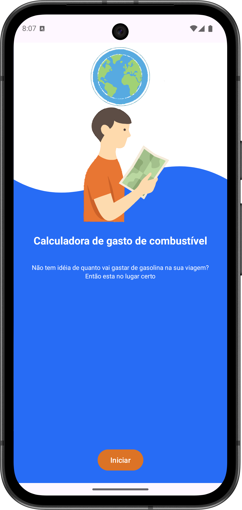
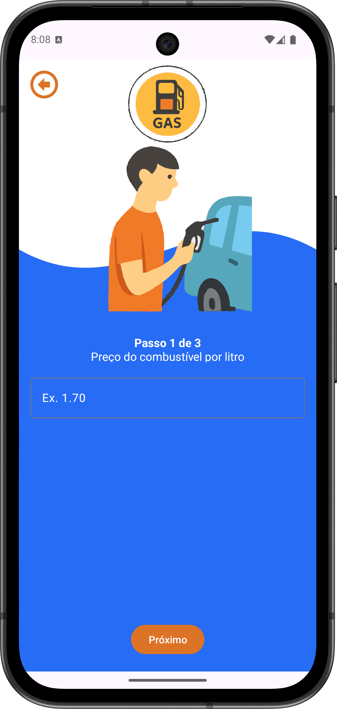
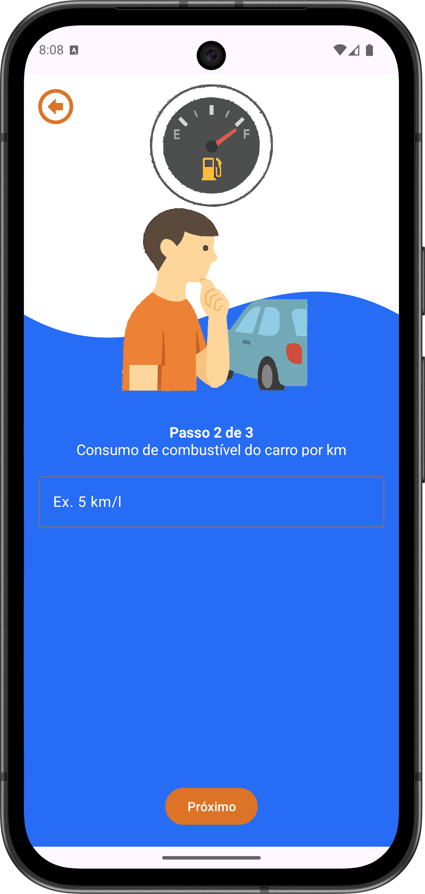
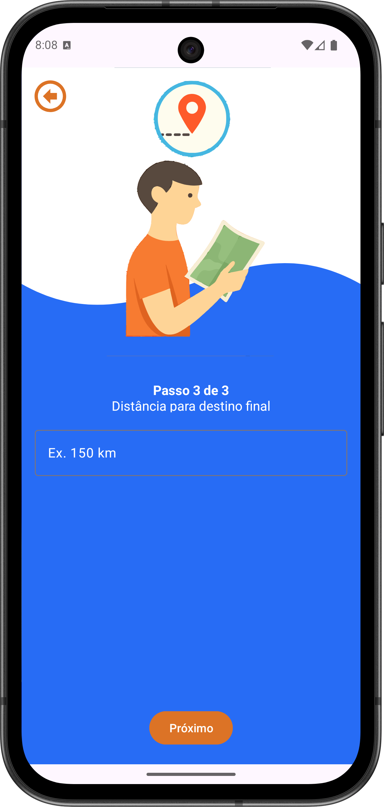
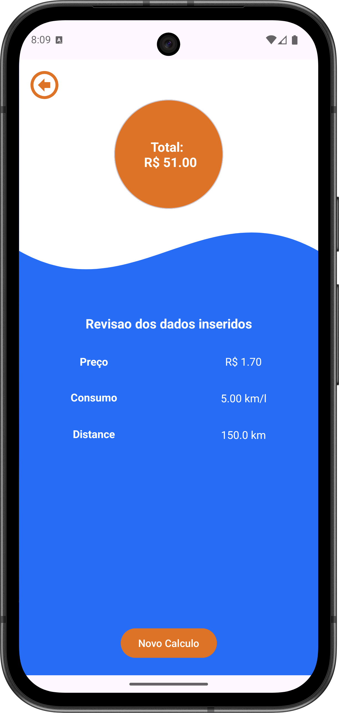

# ⛽ Calculator of Trip

**Calculator of Trip** is an Android app built with **Kotlin** that estimates **fuel usage and trip cost** based on user inputs (distance, fuel price, and vehicle consumption).  
This project focuses on **input validation**, correct **formatting**, and a smooth, user-friendly calculation flow using **Fragments** and **Navigation**.

---

## 🧭 Overview

With Calculator of Trip you can:

- Enter the trip **distance**
- Provide the vehicle **fuel consumption**
- Inform the **fuel price**
- Navigate through screens to confirm inputs and view the estimated:
  - **Fuel needed** (liters)
  - **Total trip cost**

---

## ✨ Features

- ✅ Fuel usage and cost estimation based on user inputs  
- ✅ Input validation (empty values, invalid numbers, edge cases)  
- ✅ Result formatting for better readability  
- ✅ Simple and intuitive navigation flow between screens  

---

## ⚙️ Technologies

- **Language:** Kotlin  
- **UI:** XML Views  
- **Android Components:** Fragments  
- **Navigation:** Jetpack Navigation Component  
- **Concepts Practiced:** validation, formatting, clean UI flow  

---

## 🧪 Notes

- All calculations are performed locally (no external API).
- The project can be extended with:
  - Cost splitting per person
  - Different consumption units and currency formatting
  - Saving/sharing the result

---

## 📸 Screenshots

    
